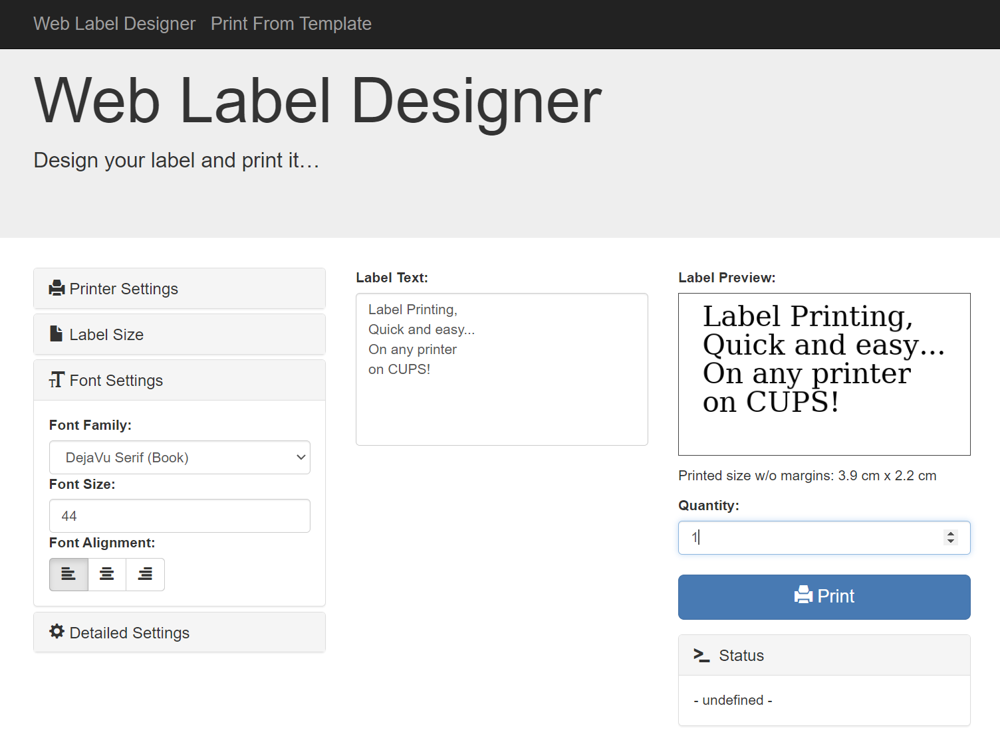

# label\_web

This is a web service to print labels on (label) printers exposed via CUPS. Based on, but heavily modified from 
[Brother_QL_Web](https://github.com/hackathi/brother_ql_web).

Primarily, I use this in conjunction with [Grocy](https://grocy.info/) for label printing, so there are some features 
that are built with that tool in mind, but the intent is to make this flexible and useful in other scenarios.

If not using the docker container, you need Python 3 for this software to work.

The web interface is [responsive](https://en.wikipedia.org/wiki/Responsive_web_design).
There's also a screenshot showing [how it looks on a smartphone](./static/images/screenshots/Label-Designer_Phone.png)

## Installation

### Docker Compose (preferred) 
docker-compose.yaml

    services:
      label_web:
        image: cvergaray/label_web_2:latest
        container_name: label_web
        ports:
          - 8013:8013
        volumes:
          - <Your Local Path>/Label_Config:/appconfig
          - <Your Local Path>/label_plugins:/app/elements/Custom

1. Create a file at `<Your Local Path>/Label_Config/config.json`, add the contents from 
[config.example.json](./config.example.json), and update with your configuration. See the [Configuration Section](#configuration-file) for details.

2. Add any template (.lbl) files to the same `<Your Local Path>/Label_Config/config.json` folder

3. Add any Custom element plugins to the `<Your Local Path>/Label_Config/label_plugins` folder

## Configuration file

Copy `config.example.json` to `config.json` (e.g. `cp config.example.json config.json`) and adjust the values 
to match your needs.

There are some printer-specific settings to include in config.json:

- `LABEL_SIZES`, a dictionary of items with a key and the human-readable description of that size
- `LABEL_PRINTABLE_AREA`, a dictionary of items mapping the same keys to the printable area in DPI
- `PRINTER`, the name of the default printer to be used as exposed by CUPS
- `DEFAULT_SIZE`, the key of the size from the `LABEL_SIZES` that should be used by default.

## Documentation

Comprehensive documentation is available in the `docs/` folder:

- **[Template File Elements Documentation](docs/TemplateElements.md)** - Complete reference for all template elements, form field customization, and data handling
- **[Minimal Configuration Guide](docs/MINIMAL_CONFIG_GUIDE.md)** - Quick start guide for configuration with minimal required settings
- **[Custom Label Sizes Guide](docs/CUSTOM_SIZES_GUIDE.md)** - Instructions for configuring custom label sizes for your printers
- **[Manual Installation Guide](docs/ManualInstall.md)** - Step-by-step guide for installing without Docker
- **[Plugin Development Guide](docs/PluginDevelopmentGuide.md)** - Guide for developing custom element plugins

## Template File

Labels are defined in template files. The templates are specific to how you want the label to look, which 
depends on the printer/media available and what data you would like on the label. An in-depth description of the label
template elements can be found in the [Template File Elements Documentation](docs/TemplateElements.md).

## Usage

Once it's running, access the web interface by opening the page with your browser.
If you run it on your local machine, go to <http://localhost:8013> (You can change
the default port 8013 by remapping in the docker-compose file or using the --port argument if not using docker).
You will then be forwarded by default to the interactive web gui located at `/labeldesigner`.

All in all, the web server offers:

* a Web GUI allowing you to print your labels at `/labeldesigner`,
* an API at `/api/print/text?text=Your_Text&font_size=100&font_family=Minion%20Pro%20(%20Semibold%20)`
  to print a label containing 'Your Text' with the specified font properties.
* an API at `/api/print/template/your_template_file_name.lbl` to print labels using a label template found at your_template_file_name.lbl
* a Web GUI for selecting and printing label templates.

## Roadmap

### Features: 
- [X] Support any CUPS printer instead of only Brother QL Printers
- [X] Select from any shared printer on the CUPS server
- [X] Automatically resize text to fit the label
- [X] Print Quantity (printing multiple labels at a time)
- [X] Label Template support (e.g. Configure a Grocy label without code changes)
- [X] Containerized for ease of deployment
- [X] Created Plugin Architecture for visual elements
- [X] GUI for printing template files from web UI
- [ ] GUI for Creating/Editing template files from Web UI

### Element Plugins:

These plugins are built-in, but please feel free to request additional ones or develop your own!

- Rendering:
  - [x] Text
  - [x] Datamatrix
  - [x] Image File
  - [x] Image URL
  - [x] Over 100 Code Types (Code39, Code12 QR Code etc. https://github.com/bwipp/postscriptbarcode/wiki/Symbologies-Reference)
  - [ ] Line
  - [ ] Rectangle
  - [ ] Circle
- Non-Rendering:
  - [x] Data Array Index
  - [x] Data Dict Item
  - [x] [GROCY](https://grocy.info/) Entry
  - [x] JSON API
  - [x] JSON Payload
  - [ ] Layout Helpers (Center, Stack Layout, Etc.)

## License

This software is published under the terms of the GPLv3, see the LICENSE file in the repository.

Parts of this package are redistributed software products from 3rd parties. They are subject to different licenses:

* [Bootstrap](https://github.com/twbs/bootstrap), MIT License
* [Glyphicons](https://getbootstrap.com/docs/3.3/components/#glyphicons), MIT License (as part of Bootstrap 3.3)
* [jQuery](https://github.com/jquery/jquery), MIT License
* [treepoem](https://github.com/weinbusch/treepoem), MIT License
* [Ghostscript](https://ghostscript.com/licensing/), AGPL/GPL

Plugin architecture based on [example code provided](https://gist.github.com/dorneanu/cce1cd6711969d581873a88e0257e312) 
by GitHub user [Victor Dorneau](https://gist.github.com/dorneanu)